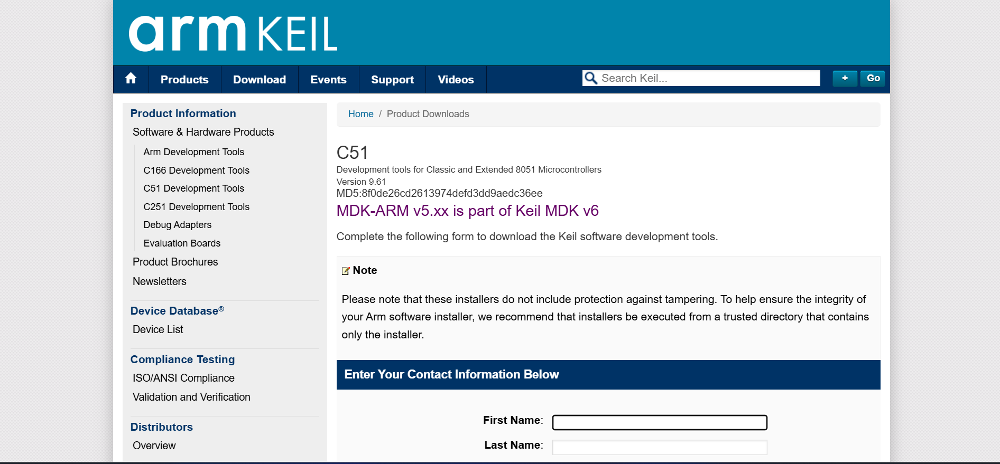

# 8051 Microprocessor

This repository contains code and resources related to the 8051 microprocessor.

## Features

- Example programs for 8051 microcontroller
- Schematics and documentation
- Assembly

## Getting Started

1. Clone the repository:
    ```bash
    git clone https://github.com/yourusername/8051mP.git
    ```

## Requirements

- 8051 microcontroller or compatible emulator
- Keil uVision or any 8051 assembler/compiler

### Required Downloading instructions

#### Keil uVision
- Go to this [Keil uVision](https://www.keil.com/download/) page and follow the instructions to download and install the software.
- 
- 
-  Fill out the information then submit

- From here download the .exe file and install


#### MCU 8051 IDE
- Go to this [MCU 8051 IDE]() and download and install
 

#### Environment Setup
- Search enviroment and then click on this

- 
- double click on path

- 


## Contributing

Contributions are welcome! Please open issues or submit pull requests.

## License

This project is licensed under the MIT License.
